# Frontend Architecture README

가상 피팅 플랫폼 프론트엔드 상세 설계 문서  


## Table of Contents

- [1. Document Role](#1-document-role)
- [2. Frontend Mission](#2-frontend-mission)
- [3. Product Assumptions](#3-product-assumptions)
- [4. Scope](#4-scope)
- [5. Non-Goals](#5-non-goals)
- [6. Frontend Core Principles](#6-frontend-core-principles)
- [7. Technology Stack](#7-technology-stack)
- [8. High-Level Frontend Architecture](#8-high-level-frontend-architecture)
- [9. Route and Page Structure](#9-route-and-page-structure)
- [10. User Journey and Screen Flow](#10-user-journey-and-screen-flow)
- [11. Page-by-Page Design](#11-page-by-page-design)
- [12. Component Architecture](#12-component-architecture)
- [13. State Management Strategy](#13-state-management-strategy)
- [14. API Integration Strategy](#14-api-integration-strategy)
- [15. Upload Experience Design](#15-upload-experience-design)
- [16. Processing Experience Design](#16-processing-experience-design)
- [17. Garment Selection Experience Design](#17-garment-selection-experience-design)
- [18. Result Viewer Design](#18-result-viewer-design)
- [19. React Three Fiber Scene Design](#19-react-three-fiber-scene-design)
- [20. Data Models for Frontend](#20-data-models-for-frontend)
- [21. Error Handling Design](#21-error-handling-design)
- [22. Loading and Empty State Design](#22-loading-and-empty-state-design)
- [23. Accessibility](#23-accessibility)
- [24. Responsive Design](#24-responsive-design)
- [25. Performance Strategy](#25-performance-strategy)
- [26. Analytics and Telemetry](#26-analytics-and-telemetry)
- [27. Testing Strategy](#27-testing-strategy)
- [28. Suggested Folder Structure](#28-suggested-folder-structure)
- [29. Environment Variables](#29-environment-variables)
- [30. Coding Conventions](#30-coding-conventions)
- [31. Implementation Roadmap](#31-implementation-roadmap)
- [32. Open Frontend Questions](#32-open-frontend-questions)

## 1. Document Role

### Main Purpose

- 프론트엔드 구현 기준 문서 역할
- 화면 설계 문서 역할
- 상태 관리 기준 문서 역할
- API 연동 규약 문서 역할
- 3D viewer UX 기준 문서 역할

## 2. Frontend Mission

### 본질적 역할

프론트엔드의 핵심 역할:

- 잘못된 입력 최소화
- 긴 처리 시간 동안 사용자 불안 감소
- 복잡한 백엔드 상태의 사용자 친화적 번역
- 3D 결과의 신뢰 가능한 시각화
- 재시도와 실패 복구의 쉬운 UX 제공

### 성공 기준

- 사용자의 업로드 실수 감소
- job 상태 이해 용이성
- garment 선택 과정의 부담 감소
- 최종 결과의 부드러운 로딩
- 모바일과 데스크톱 모두에서 usable한 viewer 경험

## 3. Product Assumptions

### Frontend 기준 전제

- 백엔드의 job 기반 비동기 처리 구조 존재
- direct upload 방식 사용
- SSE 또는 polling 방식의 상태 조회 가능
- garment catalog API 존재
- 최종 결과 `.glb`와 thumbnail URL 제공 가능

### UI 설계 전제

- 사진 1장 업로드 기반 flow
- 정면 전신 사진 중심 품질 정책
- garment category 제한 존재
- 결과의 의미가 "예상 시뮬레이션"이라는 제품 정책 존재

## 4. Scope

### Frontend MVP Scope

- 업로드 페이지
- 입력 가이드 패널
- 업로드 전 클라이언트 검증
- job 진행 상태 표시
- garment 선택 UI
- measurement 요약 카드
- result viewer
- 에러 / 재시도 UX
- 관리자용 간단 garment 관리 화면 골격

### Frontend 산출물 범위

- React SPA 또는 route 기반 웹 앱
- API 연동 layer
- SSE/polling 상태 구독 layer
- R3F 기반 3D viewer
- 테스트 코드
- UI 컴포넌트 구조

## 5. Non-Goals

### 초기 프론트엔드 비목표

- 복잡한 소셜 기능
- 실시간 멀티 유저 동기화
- 과도한 애니메이션 중심 랜딩 경험
- 과한 post-processing 기반 3D 연출
- 자체 auth 설계 확정
- CMS 수준 garment admin 완성도

## 6. Frontend Core Principles

### Principle 1: 입력 품질 통제 우선

중요 포인트:

- 업로드 성공보다 업로드 품질 중요
- 잘못된 입력의 조기 차단 중요
- 촬영 가이드의 전면 배치 중요

### Principle 2: 사용자 상태 인지성 우선

중요 포인트:

- "지금 무슨 작업 중인지"의 명확한 설명
- 백분율보다 단계 기반 상태 표시 우선
- 실패 시 원인과 다음 행동의 명확한 안내 중요

### Principle 3: 네트워크와 3D 자산의 분리

중요 포인트:

- API 서버는 metadata 중심
- 대용량 asset은 storage/CDN 직접 접근
- viewer와 control UI의 결합 최소화

### Principle 4: 3D viewer보다 flow UX 우선

중요 포인트:

- 첫 화면부터 고급 viewer보다 업로드 성공률 우선
- 처리 대기 중 UX 품질 중요
- 결과 로딩 전 skeleton/thumbnail fallback 중요

### Principle 5: 상태 소유권 명확화

기준:

- 서버 상태: React Query
- 클라이언트 UI 상태: Zustand
- 3D scene 로컬 상태: viewer 내부 state 또는 dedicated store

## 7. Technology Stack

### Recommended Stack

| 영역 | 기술 |
|---|---|
| App | React + TypeScript |
| Bundler | Vite |
| Routing | React Router |
| Server State | TanStack Query |
| Client UI State | Zustand |
| Forms | React Hook Form 가능 |
| HTTP | Axios 또는 Fetch wrapper |
| 3D | Three.js + React Three Fiber |
| 3D Helper | `@react-three/drei` |
| Styling | Tailwind CSS 또는 CSS Modules |
| Validation | Zod |
| Testing | Vitest + React Testing Library + Playwright |

### Why This Stack

- React Query: job 상태 polling/SSE 보조 적합성
- Zustand: 전역 UI 상태의 단순성
- R3F: Three.js와 React UI의 연결 용이성
- Vite: 개발 속도와 설정 단순성

## 8. High-Level Frontend Architecture

### Architecture Diagram

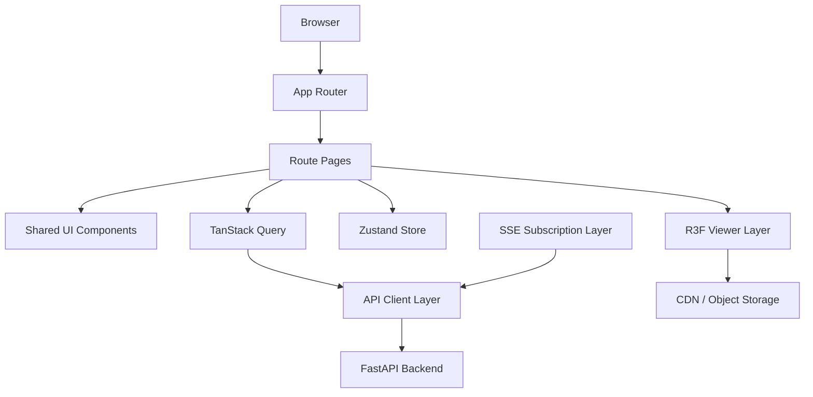

### Layer Responsibilities

| Layer | 역할 |
|---|---|
| Router | 페이지 전환과 route param 관리 |
| Pages | 화면 단위 orchestration |
| Shared UI | 재사용 컴포넌트 |
| Query Layer | 서버 상태 fetch/cache/invalidation |
| Store Layer | UI 상태, viewer 설정, selection 상태 |
| API Layer | endpoint wrapper |
| SSE Layer | 실시간 진행 상태 수신 |
| Viewer Layer | `.glb` 로딩, camera, controls, lighting |

## 9. Route and Page Structure

### Recommended Routes

| Route | 목적 |
|---|---|
| `/` | 업로드 시작 페이지 |
| `/jobs/:jobId/processing` | body reconstruction 진행 상태 페이지 |
| `/jobs/:jobId/garments` | garment 선택 페이지 |
| `/results/:resultId` | 최종 결과 viewer 페이지 |
| `/admin/garments` | garment 관리 페이지 |
| `/admin/garments/:garmentId` | garment 상세 관리 페이지 |

### Route Flow Diagram

```mermaid
flowchart LR
    Home[/]
    Processing[/jobs/:jobId/processing]
    Garments[/jobs/:jobId/garments]
    Result[/results/:resultId]
    Admin[/admin/garments]

    Home --> Processing
    Processing --> Garments
    Garments --> Result
```

### Route Design Principles

- URL만으로 현재 단계 이해 가능성
- 새로고침 시 상태 복구 가능성
- 공유 가능한 결과 페이지 URL 구조
- route param 기준 데이터 조회 단순성

## 10. User Journey and Screen Flow

### User Journey Diagram

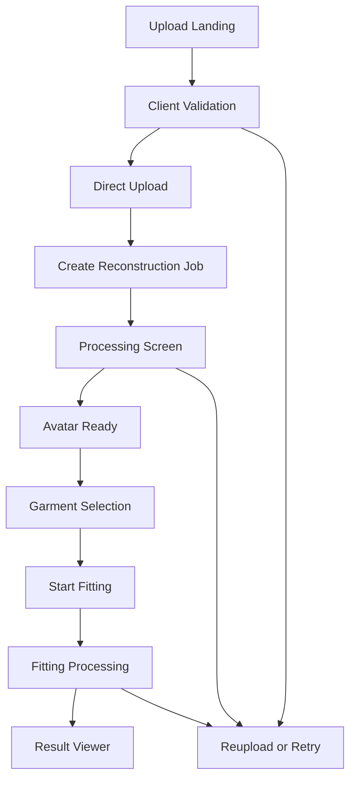

### Frontend UX Objective per Phase

| 단계 | UX 목적 |
|---|---|
| Upload | 실수 감소 |
| Processing | 불안 감소 |
| Garment Selection | 선택 부담 완화 |
| Result Viewer | 결과 이해와 몰입감 |
| Error/Retry | 이탈 방지 |

## 11. Page-by-Page Design

## Upload Page

### Main Goals

- 촬영 가이드 노출
- 업로드 시작
- 파일 선택 즉시 검증
- 잘못된 입력 사전 차단

### Main Blocks

- Hero / Intro section
- Photo guide panel
- Upload dropzone
- Client validation summary
- Example image guidance
- CTA button

### Important UI States

- idle
- dragging
- file selected
- local validation warning
- local validation error
- presign 요청 중
- direct upload 진행 중

## Processing Page

### Main Goals

- 현재 단계 명확한 표시
- 사용자의 대기 불안 감소
- 처리 예상 흐름 설명
- 실패 시 재업로드 유도

### Main Blocks

- current status headline
- step progress timeline
- percent indicator
- preview thumbnail
- quality warning badge
- retry / cancel guidance

### Important UI States

- waiting for first status
- validating
- reconstructing
- avatar_ready redirect 준비
- failed
- needs_reupload

## Garment Selection Page

### Main Goals

- body reconstruction 완료 후 선택 흐름 연결
- 지원 garment만 안정적으로 노출
- garment 선택 후 fitting 시작

### Main Blocks

- avatar summary card
- measurement summary card
- category tabs
- garment grid/carousel
- garment detail side panel
- fit mode selector
- fitting CTA

### Important UI States

- catalog loading
- empty category
- garment selected
- fitting request 중
- garment metadata incomplete warning

## Result Viewer Page

### Main Goals

- 최종 결과의 빠른 시각화
- 회전/확대/축소 제공
- 정면/측면/후면 비교 편의성
- 로딩과 에러 fallback 제공

### Main Blocks

- 3D viewer canvas
- camera preset controls
- result summary panel
- garment info panel
- measurement summary
- retry / choose another garment CTA
- share/download placeholder area

### Important UI States

- metadata loading
- glb loading
- partial asset failure
- viewer ready
- unsupported device fallback

## Admin Garment Page

### Main Goals

- garment catalog 확인
- 상태 필터링
- preprocessing 상태 확인
- 운영자 검수 보조

## 12. Component Architecture

### Component Tree

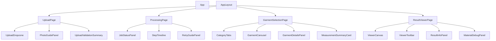

### Component Layer Split

| 레이어 | 구성 |
|---|---|
| `pages/` | route-level orchestration |
| `widgets/` | page section block |
| `features/` | 기능 단위 UI + logic |
| `entities/` | domain UI model |
| `shared/` | button, modal, loader, util |

### Recommended Domain-Oriented Component Groups

- `features/upload`
- `features/job-status`
- `features/garment-selection`
- `features/result-viewer`
- `features/admin-garment`

## 13. State Management Strategy

### State Ownership Principle

중요 기준:

- 서버에서 진실의 원천을 가지는 값 -> Query
- 사용자 인터랙션 기반 임시 값 -> Zustand
- input 내부 상태 -> local component state
- 3D scene 내부 일시 상태 -> viewer-local state

### State Diagram

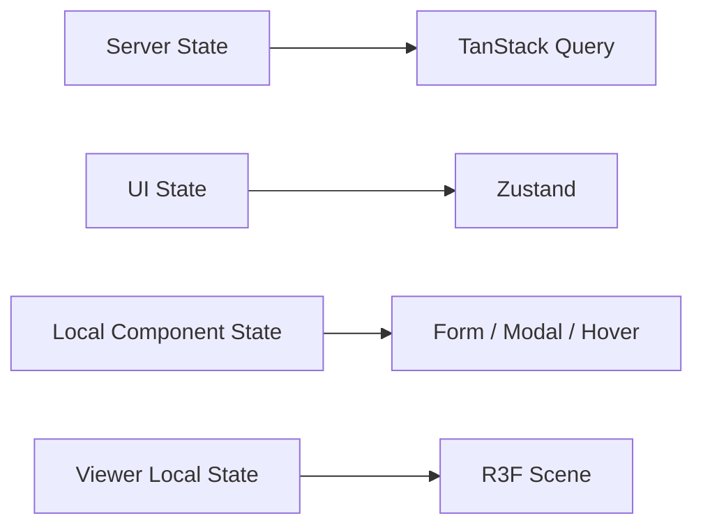

### React Query Ownership

- garment catalog
- current job status
- result metadata
- avatar summary
- admin garment list

### Zustand Ownership

- selected garment id
- selected category
- fit mode
- upload draft metadata
- viewer background toggle
- viewer debug toggle
- camera preset
- material override debug state

### Local State Ownership

- drag over state
- form input state
- dialog open/close state
- hover card open state

### Cache Strategy

- garment catalog: relatively long stale time
- job status: short stale time 또는 SSE 실시간 반영
- result metadata: medium stale time
- admin list: filter 기준 invalidate

## 14. API Integration Strategy

### Frontend API Layer Goals

- endpoint 호출 캡슐화
- request/response 타입 일관성
- error normalization
- query key 표준화

### API Flow Summary

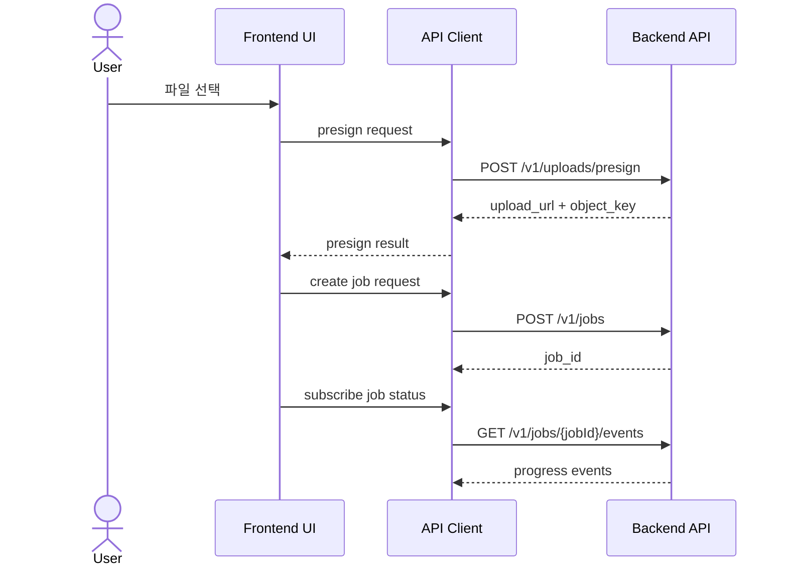

### Recommended Query Keys

```ts
const queryKeys = {
  garments: ["garments"] as const,
  garmentsByCategory: (category: string) => ["garments", "category", category] as const,
  job: (jobId: string) => ["job", jobId] as const,
  jobEvents: (jobId: string) => ["job-events", jobId] as const,
  avatar: (avatarId: string) => ["avatar", avatarId] as const,
  result: (resultId: string) => ["result", resultId] as const,
  adminGarments: ["admin", "garments"] as const,
};
```

### Main Endpoint Consumption

| Endpoint | Frontend 사용 목적 |
|---|---|
| `POST /v1/uploads/presign` | direct upload 준비 |
| `POST /v1/jobs` | reconstruction job 시작 |
| `GET /v1/jobs/{jobId}` | fallback polling |
| `GET /v1/jobs/{jobId}/events` | SSE 진행률 수신 |
| `GET /v1/garments` | garment 카탈로그 조회 |
| `POST /v1/jobs/{jobId}/fit` | fitting 시작 |
| `GET /v1/results/{resultId}` | result viewer metadata 조회 |

### Error Normalization Shape

권장 error shape:

```ts
type ApiError = {
  code: string;
  message: string;
  status: number;
  retryable?: boolean;
};
```

## 15. Upload Experience Design

### Upload Flow Diagram

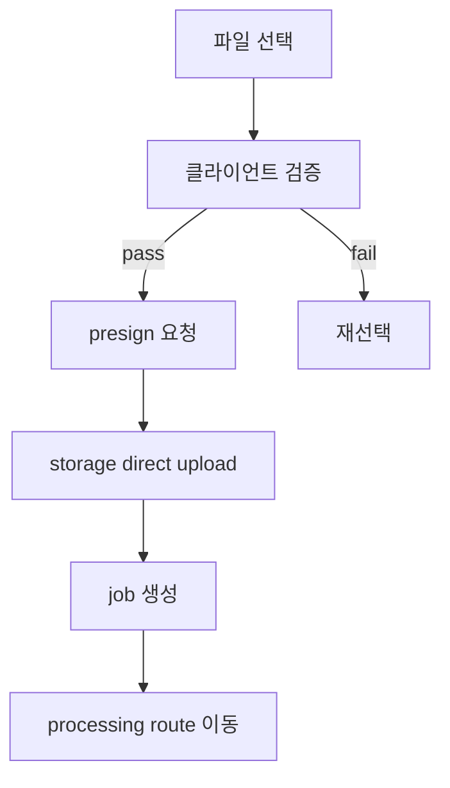

### Local Validation Rules

| 규칙 | 예시 기준 |
|---|---|
| 형식 | `jpg`, `jpeg`, `png`, `webp` |
| 용량 | 15MB 이하 |
| 해상도 | 1024x1536 이상 |
| 방향 | 세로 이미지 권장 |
| EXIF | 회전 보정 필수 |

### UX Messaging Priorities

- 전신이 모두 보여야 함
- 머리와 발의 절단 금지
- 복잡한 배경 지양
- 과한 가림 지양
- 밝은 조명 권장

### Upload State Model

- `idle`
- `validating`
- `presigning`
- `uploading`
- `creating_job`
- `redirecting`
- `failed`

### Important Edge Cases

- 사용자가 같은 파일 재업로드 시도
- EXIF rotation으로 인한 잘못된 preview
- presign 성공 후 upload 실패
- upload 성공 후 job 생성 실패
- job 생성 성공 후 route 이동 실패

## 16. Processing Experience Design

### Processing UX Goals

- 사용자가 기다리는 이유 이해 가능성
- 현재 단계의 명확한 인식
- 실패 시 재업로드 동선 확보
- background tab 복귀 시 상태 복원

### Processing Layout Blocks

- title area
- status message
- step timeline
- progress bar
- preview image
- quality notice
- retry panel

### SSE First Strategy

우선 방식:

- SSE 연결 시도
- 실패 시 polling fallback
- 일정 시간 idle 시 polling 강제 전환 가능

### Processing Screen State Machine

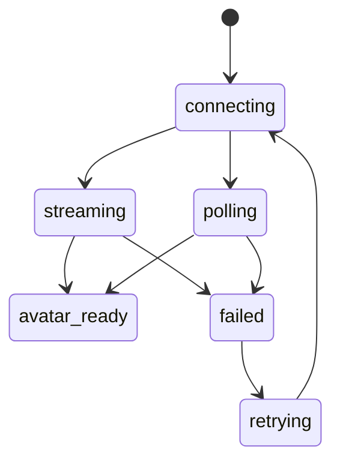

### User-Facing Status Copy Categories

- 입력 검사 중
- 인체 분리 중
- 포즈 추정 중
- 3D body 생성 중
- 텍스처 구성 중
- 피팅 준비 완료

## 17. Garment Selection Experience Design

### Core Goals

- garment 선택 피로도 감소
- 현재 body summary와 garment 선택의 연결
- fitting 실행 전 확신 제공

### Screen Layout Suggestion

- 상단: avatar summary
- 좌측: category tabs
- 중앙: garment grid / carousel
- 우측: garment details panel
- 하단: fit CTA bar

### Garment Selection State Flow

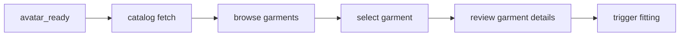

### Important UI Elements

- category filter
- garment thumbnail
- fabric type badge
- base size info
- fit mode selector
- selected garment highlight
- CTA disabled state

### CTA Enable Conditions

- avatar_ready 상태
- garment 선택 완료
- fitting 요청 중 아님
- required metadata 존재

## 18. Result Viewer Design

### Viewer Goals

- 첫 로딩 안정성
- 회전/확대/축소 직관성
- 전면/측면/후면 빠른 비교
- viewer 자체 에러 복구 가능성

### Result Viewer Layout

- main canvas
- top toolbar
- side info panel
- bottom preset controls
- optional debug panel

### Viewer Interaction Model

| 기능 | 목적 |
|---|---|
| orbit rotate | 자유 시점 확인 |
| zoom | 디테일 확인 |
| pan | 선택 기능 여부에 따라 제한적 허용 |
| preset camera | 정면/측면/후면 빠른 이동 |
| reset | 초기 시점 복원 |

### Viewer Loading Stages

- result metadata loading
- glb fetch
- parse
- texture upload to GPU
- first frame rendered

### Viewer Fallback Priority

1. loading skeleton
2. thumbnail preview
3. static fallback image
4. retry button

## 19. React Three Fiber Scene Design

### Viewer Pipeline Diagram

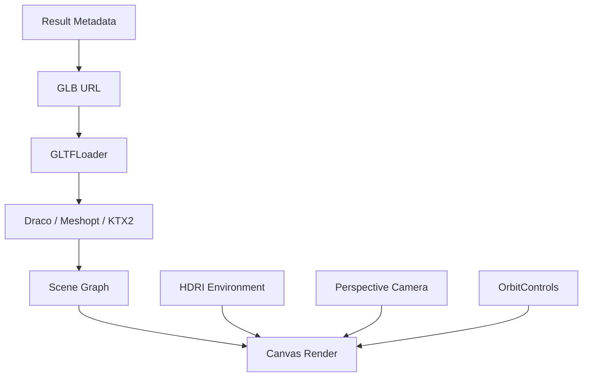

### Recommended Scene Components

- `ViewerCanvas`
- `ViewerScene`
- `ModelRoot`
- `EnvironmentLighting`
- `CameraController`
- `PresetCameraButtons`
- `ViewerPerformanceGuard`

### Lighting Strategy

- HDRI 기반 environment light
- soft directional light 보조 가능
- contact shadow 또는 ground shadow 선택적 적용

### Material Strategy

- 원본 glTF PBR material 최대한 유지
- runtime override 최소화
- debug mode에서 wireframe/material info 노출 가능

### Camera Strategy

- 기본 정면 시점
- bbox 기반 auto framing
- preset camera positions
- reset camera 기능

### Performance Guard

- 모바일 DPR 제한
- visibility 기반 render loop 제어 검토
- post-processing 최소화
- heavy debug 옵션 기본 비활성화

## 20. Data Models for Frontend

### Core DTOs

```ts
type JobStatus =
  | "created"
  | "image_uploaded"
  | "validating_input"
  | "reconstructing_body"
  | "extracting_measurements"
  | "building_avatar_assets"
  | "avatar_ready"
  | "garment_selected"
  | "fitting_garment"
  | "optimizing_result"
  | "completed"
  | "failed"
  | "needs_reupload";

type JobResponse = {
  job_id: string;
  status: JobStatus;
  progress_step: string | null;
  progress_percent: number | null;
  avatar_id: string | null;
  result_id: string | null;
  error_code: string | null;
  error_message?: string | null;
};

type GarmentSummary = {
  garment_id: string;
  name: string;
  category: string;
  thumbnail_url?: string;
  fabric_type?: string;
  base_size?: string;
  status?: string;
};

type ResultResponse = {
  result_id: string;
  glb_url: string;
  thumbnail_url?: string;
  measurements?: Record<string, number>;
};
```

### Frontend View Models

권장 이유:

- API DTO와 UI 모델 분리
- naming normalization
- optional field 처리 단순화

예시:

```ts
type ProcessingStepViewModel = {
  title: string;
  description: string;
  percent: number;
  tone: "default" | "warning" | "danger" | "success";
};
```

## 21. Error Handling Design

### Error Category Model

| category | 예시 |
|---|---|
| validation | 형식 오류, 해상도 부족 |
| network | presign 실패, upload 실패 |
| processing | reconstruction 실패 |
| fitting | garment fitting 실패 |
| viewer | glb 로드 실패 |

### Error Flow Diagram

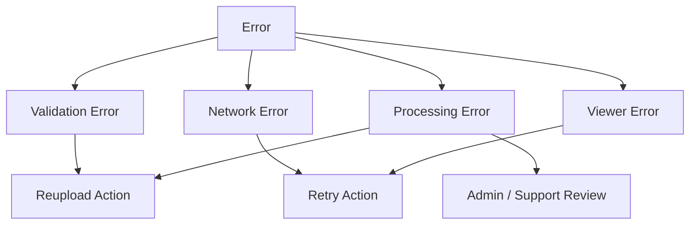

### Error UI Principles

- 사용자 탓처럼 보이는 문구 지양
- 다음 행동 명시
- retry 가능 여부 명시
- technical code는 숨기고 debug id 정도만 노출

### Retry Policy on Frontend

- presign 실패: 즉시 retry 허용
- upload 실패: retry 허용
- job status fetch 실패: 자동 재시도 제한적 허용
- result glb 로드 실패: retry 버튼 제공

## 22. Loading and Empty State Design

### Loading State Types

- initial page load
- catalog loading
- result metadata loading
- glb loading
- admin list loading

### Empty State Types

- garment 없음
- category 결과 없음
- measurements 없음
- result metadata partial 없음

### Skeleton Strategy

- 카드형 UI skeleton
- progress timeline skeleton
- viewer 영역 placeholder
- measurement panel skeleton

## 23. Accessibility

### Accessibility Priorities

- keyboard 접근성
- 버튼과 링크의 명확한 focus state
- 업로드 드롭존의 키보드 접근 가능성
- 진행 상태 문구의 스크린리더 접근성
- color-only status 표현 지양

### Important Accessibility Targets

- `aria-live`를 활용한 progress update 전달
- 드롭존의 button 역할 제공
- preset controls의 명확한 label
- motion reduction 대응

## 24. Responsive Design

### Device Strategy

| 구간 | 기준 |
|---|---|
| mobile | 업로드와 결과 확인 중심 |
| tablet | garment 탐색 강화 |
| desktop | full viewer + side panel 최적화 |

### Layout Priorities by Device

#### Mobile

- single-column layout
- 간결한 CTA
- viewer 높이 제한
- side panel의 bottom sheet화

#### Desktop

- 2-column 또는 3-area layout
- viewer와 info panel 동시 노출
- garment grid 확장

## 25. Performance Strategy

### Frontend Performance Goals

- 초기 route 진입 속도 확보
- 업로드 전 상호작용 지연 최소화
- viewer 첫 프레임 시간 단축
- 모바일 GPU 부담 최소화

### Main Performance Techniques

- route-based code splitting
- R3F viewer lazy loading
- garment card image 최적화
- KTX2 / meshopt 활용 전제
- large panel virtualization 검토
- unnecessary rerender 억제

### Performance Hotspots

- 대형 `.glb` 파싱
- texture 업로드
- unnecessary React rerender
- polling 과다 호출
- mobile DPR 과다

### Performance Checklist

- `Suspense` fallback 설계
- query stale time 조정
- viewer 진입 전 metadata 선조회
- canvas resize 최소화
- post-processing 기본 비활성화

## 26. Analytics and Telemetry

### Frontend Event Candidates

- upload_started
- upload_validation_failed
- upload_completed
- job_processing_viewed
- garment_selected
- fitting_started
- result_viewed
- viewer_retry_clicked
- reupload_clicked

### Why Analytics

- 이탈 구간 파악 목적
- 입력 품질 정책 개선 목적
- garment 클릭 대비 fitting 시작률 분석 목적
- viewer 도달률 분석 목적

## 27. Testing Strategy

### Testing Pyramid

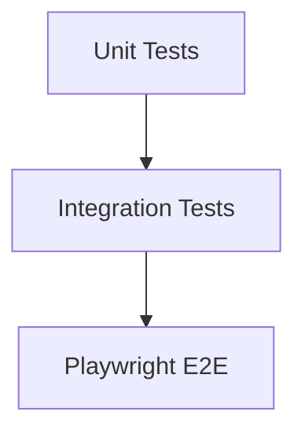

### Unit Test Targets

- file validation util
- progress step mapper
- query key helper
- error normalization util
- viewer camera preset util

### Integration Test Targets

- upload flow component
- processing page SSE fallback logic
- garment selection interaction
- result viewer metadata fetch flow

### E2E Test Targets

- 파일 업로드부터 processing 진입
- job 상태 완료 후 garment page 이동
- fitting 시작 후 result page 이동
- result viewer 표시

### 3D Viewer Test Note

- 실제 WebGL 완전 렌더 검증보다 smoke test 중심
- metadata 로드와 viewer mount 성공 여부 우선

## 28. Suggested Folder Structure

### Recommended Structure

```text
apps/web/
├── public/
├── src/
│   ├── app/
│   │   ├── router/
│   │   ├── providers/
│   │   └── layouts/
│   ├── pages/
│   │   ├── upload/
│   │   ├── processing/
│   │   ├── garments/
│   │   ├── result/
│   │   └── admin/
│   ├── features/
│   │   ├── upload/
│   │   ├── job-status/
│   │   ├── garment-selection/
│   │   ├── result-viewer/
│   │   └── admin-garment/
│   ├── entities/
│   │   ├── job/
│   │   ├── garment/
│   │   ├── result/
│   │   └── avatar/
│   ├── shared/
│   │   ├── api/
│   │   ├── ui/
│   │   ├── lib/
│   │   ├── config/
│   │   └── types/
│   ├── viewer/
│   │   ├── components/
│   │   ├── hooks/
│   │   ├── scene/
│   │   └── utils/
│   └── tests/
├── package.json
└── vite.config.ts
```

### Directory Responsibility

| 경로 | 역할 |
|---|---|
| `app/` | provider, router, layout |
| `pages/` | route-level page |
| `features/` | 기능 중심 UI + logic |
| `entities/` | domain model adapter |
| `shared/api` | request wrapper, endpoint client |
| `shared/ui` | 공통 UI |
| `viewer/` | R3F 전용 계층 |

## 29. Environment Variables

### Expected Variables

| 변수 | 의미 |
|---|---|
| `VITE_API_BASE_URL` | API base URL |
| `VITE_APP_ENV` | 실행 환경 식별 |
| `VITE_SENTRY_DSN` | 에러 트래킹 |
| `VITE_ENABLE_VIEWER_DEBUG` | viewer debug 기능 노출 여부 |
| `VITE_ENABLE_ADMIN_PAGES` | admin route 노출 여부 |

### Environment Usage Principles

- 빌드 시점 설정과 런타임 설정 구분 필요
- secret 직접 포함 금지
- feature flag 성격의 변수 최소화 권장

## 30. Coding Conventions

### Naming

- 컴포넌트: PascalCase
- hook: `use*`
- store: `create*Store`
- query key: factory pattern 권장

### Component Design Conventions

- page component는 orchestration 중심
- presentational component는 dumb UI 중심
- domain mapping은 entity 또는 adapter 계층 배치
- API response shape의 page 직접 사용 지양

### Styling Conventions

- spacing / color / radius token 일관성
- viewer 주변 패널과 3D canvas의 정보 우선순위 구분
- 과한 decoration 지양

### Frontend Code Review Focus

- state ownership 적절성
- query invalidation 적절성
- viewer rerender 최소화 여부
- upload edge case 대응 여부
- accessibility 누락 여부

## 31. Implementation Roadmap

### Build Order

1. App shell + router
2. upload page + local validation
3. direct upload flow
4. processing page + polling
5. SSE integration
6. garment selection page
7. result metadata fetch
8. R3F viewer integration
9. retry/error handling polishing
10. testing and telemetry

### Milestone Summary

#### Milestone 1

- upload page 동작
- presign + upload + job 생성
- processing page 이동

#### Milestone 2

- processing status 표시
- avatar_ready 전환 처리
- garment catalog 표시

#### Milestone 3

- garment 선택
- fitting 시작
- result route 이동

#### Milestone 4

- R3F viewer
- camera preset
- loading/error fallback

#### Milestone 5

- responsive polish
- analytics
- test coverage 확대

## 32. Open Frontend Questions

### Product Questions

- viewer에서 body-only preview 노출 여부
- fitting 전 garment try-on preview 필요 여부
- measurement 카드의 사용자 노출 범위
- 모바일에서 full 3D viewer 우선 여부

### Technical Questions

- SSE 기본값과 polling fallback의 세부 기준
- result 페이지 prefetch 전략
- meshopt / Draco / KTX2 decoder 로딩 전략
- canvas render loop 최적화 기준

### Design Questions

- 업로드 페이지의 정보 밀도
- processing page의 감성적 카피 범위
- garment selection의 grid vs carousel 우선순위
- result viewer의 info panel 기본 open 여부
